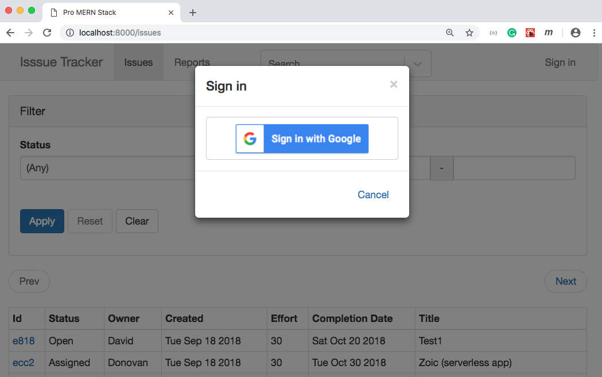

# Issue Tracker
This is a simple web application with basic issue tracking functions like JIRA.  
It has been built on **MERN** stack with following functions:

* Basic CRUD operations for creating/editing/updating/deleting issues.
* Search & Pagination
* Google Sign-In

## Installation
1. Download or clone this repo.
2. Run `$ npm install` under project directory.
3. Install and run MongoDB locally. You can use Homebrew or any other tools to install Mongo DB.  
   Run the following commands under `scripts` folder to create a local DB and populate it with a thousand of sample data.  
   *  `$ mongo init.mongo.js`
   *  `$ mongo generate_data.mongo.js`
4. Configure the `Google Client ID` for Google Sign-In.  
   Please follow the instructions in the guide to create your own project and client ID [here](https://developers.google.com/identity/sign-in/web/).  
   *  Rename `config.sample.js` to `config.js`.
   *  Create a project in Google Developer Console.
   *  Copy the Client ID and assign it to **`googleClientId`** in the **`config.js`**.
5. Run the server and the client: `$ npm run dev-all`  
  You can find more scripts to compile and run the server and the client in `"scripts"` section of the `package.json` file.

## Screenshots
### Google Sing-In

### Creating an issue

### Editing an issue

### Searching
